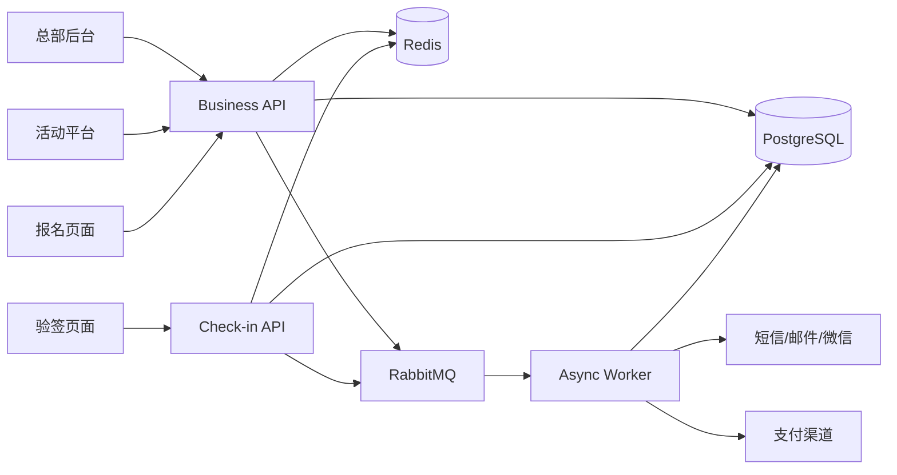

# EventVivid MVP 开发文档

> 文档版本：V1.2
> 对应 PRD：EventVivid PRD V1.3
> 目标读者：产品、交互、前端、后端、测试、运维  
> 更新日期：2026-09-23

## 1. 开发目标

MVP 必须以四个独立应用交付，打通以下完整业务闭环：

```text
总部开通租户
  → 租户登录活动平台
  → 创建活动与票种
  → 发布公开报名页
  → 参会人报名并支付
  → 系统生成电子票
  → 工作人员登录验签页
  → 首次验签成功 / 重复验签拦截
  → 活动平台与总部查看统计和审计
```

## 2. 系统组成与部署

### 2.1 独立应用

| 应用包 | 建议本地端口 | 目标域名示例 | 登录体系 | 主要设备 |
| --- | ---: | --- | --- | --- |
| `apps/hq-web` | 5174 | `hq.eventvivid.com` | 平台管理员账号 | 桌面端 |
| `apps/organizer-web` | 5173 | `console.eventvivid.com` | 租户成员账号 | 桌面端/平板 |
| `apps/attendee-web` | 5175 | `m.eventvivid.com` | 手机号验证码或匿名会话 | 移动端 |
| `apps/checkin-web` | 5176 | `checkin.eventvivid.com` | 现场工作人员账号 | 手机/手持设备 |
| `apps/api` | 3000 | `api.eventvivid.com` | JWT、公开访问令牌、幂等键 | 服务端 |
| `apps/worker` | 无 HTTP 端口 | 内部服务 | RabbitMQ 凭证 | 服务端 |

当前代码库已实现 `hq-web`，活动平台、报名页和验签页暂位于 `apps/web` 的不同路由中。MVP 收口前应按上表拆为三个独立构建与部署单元，共享 `packages/ui`、`packages/contracts` 和 `packages/api-client`。

### 2.2 技术栈

- 后端：Node.js 20 LTS、TypeScript strict、NestJS、Fastify。
- Web：React、Vite、React Router。
- 数据库：PostgreSQL，Kysely 作为类型安全访问层，复杂库存逻辑允许原生 SQL。
- 缓存：Redis，用于验证码、限流、短期会话和热点查询。
- 消息：RabbitMQ Quorum Queue，用于通知、支付后处理、导出和 Webhook。
- 文件：S3 兼容对象存储，用于封面、报名附件和导出文件。
- 测试：Vitest、Supertest、Playwright。
- 可观测性：结构化日志、OpenTelemetry、Prometheus、Grafana、Loki。

### 2.3 逻辑架构



## 3. 公共开发规范

### 3.1 身份与会话

- 总部账号与租户账号分表、分签发者、分登录入口，不共享登录态。
- 总部 JWT 建议 8 小时过期；租户后台访问令牌建议 2 小时并配刷新令牌。
- 报名页允许匿名浏览；查询个人订单时必须手机号验证码验证。
- 验签员必须被授权到活动或验签点，令牌中不得直接信任前端传入的活动范围。
- 密码使用 bcrypt/Argon2 哈希，不记录明文，不在日志中输出 Token。

### 3.2 多租户隔离

- 所有租户业务表必须包含 `tenant_id`。
- 服务层从已验证会话获取租户，不接受客户端任意指定 `tenant_id`。
- 核心查询必须显式附加租户条件；条件缺失视为代码缺陷。
- 总部接口使用 `/hq/*` 命名空间和独立 Guard。
- 租户停用或到期后，禁止写业务数据；查询与续费能力按策略保留。

### 3.3 API 约定

```json
{
  "data": {},
  "requestId": "req_01..."
}
```

错误响应：

```json
{
  "code": "TICKET_SOLD_OUT",
  "message": "该票种已售罄",
  "requestId": "req_01...",
  "details": []
}
```

- 报名、支付确认、退款和验签必须携带 `Idempotency-Key`。
- 分页统一使用 `page`、`pageSize`；列表返回 `items` 和 `total`。
- 时间统一以 ISO 8601 UTC 传输，界面按活动时区展示。
- 金额字段统一以 `amountCents` 表示整数分。

### 3.4 通用页面状态

每个数据页必须提供：

1. 首次加载骨架屏。
2. 空状态及下一步操作。
3. 网络错误和重试入口。
4. 无权限状态。
5. 会话过期后保存当前地址并跳转登录。
6. 表单提交中的禁用和防重复提交。
7. 成功提示、业务错误和字段级错误。

## 4. 应用一：总部后台

### 4.1 用户与边界

总部后台只服务 EventVivid 平台内部人员。任何租户成员均不能登录或调用总部接口。

### 4.2 页面结构

```text
/login                 总部登录
/                      平台总览
/tenants               租户管理
/tenants/:id           租户详情
/credits               电子票额度与账本
/channels              支付渠道
/risk                  风控中心
/audit                 审计日志
/settings              平台设置
```

### 4.3 登录页 `/login`

功能：

- 管理员账号、密码登录。
- 登录中按钮禁用，失败时显示统一错误，避免泄漏账号是否存在。
- 成功后保存短期 Token，跳转原目标页面或总览。
- 连续失败触发 IP 与账号维度限流。
- 登录成功、失败、退出均产生安全日志。

操作流程：

1. 输入账号和密码。
2. 前端校验非空和最小长度。
3. 调用 `POST /api/v1/hq/auth/login`。
4. 后端验证账号状态和密码哈希。
5. 签发总部 Token，更新最后登录时间并记录来源 IP。
6. 前端请求 `GET /api/v1/hq/auth/me` 恢复会话。

### 4.4 平台总览 `/`

展示：

- 租户总数、正常/停用/到期数量。
- 活动总数、今日新增活动。
- 订单总数、已支付金额、退款金额。
- 累计验签、今日验签和重复验签。
- API、数据库、消息队列、支付回调健康状态。
- 最近风险事件和总部操作。

操作：

- 时间范围切换：今日、近 7 日、近 30 日。
- 点击指标跳转对应列表并自动带筛选条件。
- 数据异常时展示最后更新时间和重试入口。

### 4.5 租户管理 `/tenants`

列表字段：租户名称、租户 ID、活动数、电子票可用额度、服务状态、存量合同有效期、开通时间、操作。

功能：

- 按名称搜索；按状态和余额区间筛选。
- 新建租户，默认状态为正常、有效期为永久或由总部指定。
- 重命名租户。
- 设置具体到期日、续期 30 天、续期一年、设为永久有效。
- 停用与恢复；停用前二次确认并说明影响。
- 到期状态：永久有效、正常、30 天内到期、已到期。
- 所有变化写入 `platform_audit_logs`，记录变更前后值。

租户管理流程：

1. 点击“开通新租户”，填写企业或组织名称。
2. `POST /api/v1/hq/tenants` 创建独立数据空间。
3. 列表刷新并展示永久有效状态。
4. 点击“管理”打开租户弹窗。
5. 修改名称或期限，调用 `PATCH /api/v1/hq/tenants/:id`。
6. 停用/恢复调用 `PATCH /api/v1/hq/tenants/:id/status`。
7. 后端在同一事务内更新租户并写审计日志。

### 4.6 租户详情 `/tenants/:id`

标签页：

- 概览：电子票余额、预留额度、存量合同有效期、成员、活动、交易和存储用量。
- 成员：租户管理员列表、邀请状态、最近登录。
- 额度：统一电子票余额、逐笔发放／消耗／返还流水；短信量和文件存储单独展示。
- 支付配置：渠道绑定状态，只展示脱敏信息。
- 操作记录：该租户相关的总部审计日志。

### 4.7 电子票额度 `/credits`

- 按租户查询统一余额、已预留、可用额度和最近 100 笔流水。
- 新租户注册或总部开通时一次性赠送 100 张；赠送与购买的电子票额度类型相同，均不设使用期限。
- 总部超级管理员和财务可按租户人工补发额度，必须填写原因、幂等流水号，并记录平台审计；人工补发不是收款成功。
- 额度包建议为 100、500、2000 张；在线购买需完成支付渠道接入、验签回调、退款和对账后再开放，未接入时只展示价格和联系开通入口。
- 存量套餐数据仅作兼容，不用于新租户开通或新销售。

### 4.8 支付渠道 `/channels`

- 微信支付、支付宝等渠道的配置状态和回调健康度。
- 商户号可展示；私钥、API 密钥只允许更新，不允许明文回显。
- 保存配置前执行连通性验证。
- 渠道停用前提示受影响的租户与未完成订单。
- 配置变化必须二次确认并写高风险审计。

### 4.9 风控中心 `/risk`

- 指标：登录失败、异常支付、库存冲突、重复验签、退款失败。
- 风险事件列表支持等级、类型、租户和时间筛选。
- 事件详情展示请求链路、关联订单、处置记录。
- 支持标记已处理、误报和转人工。

### 4.10 审计日志 `/audit`

- 字段：时间、操作人、角色、动作、对象、来源 IP、结果和追踪 ID。
- 支持按操作人、动作、对象类型和时间筛选。
- 日志只读，普通管理员无删除权限。
- 导出任务异步执行并生成带水印文件。

### 4.11 总部后台 MVP 接口

| 方法 | 路径 | 用途 |
| --- | --- | --- |
| POST | `/hq/auth/login` | 总部登录 |
| GET | `/hq/auth/me` | 当前总部用户 |
| GET | `/hq/dashboard` | 平台总览指标 |
| GET/POST | `/hq/tenants` | 查询或创建租户 |
| PATCH | `/hq/tenants/:id` | 重命名与有效期管理 |
| PATCH | `/hq/tenants/:id/status` | 停用或恢复 |
| GET/POST | `/hq/tenants/:id/credits` | 查询租户额度／人工补发额度 |
| GET | `/hq/audit-logs` | 审计日志 |

## 5. 应用二：活动管理平台

### 5.1 用户与边界

网站公开区域面向潜在客户，介绍 EventVivid 产品与电子票额度；登录后的工作区域服务租户内部团队。用户登录后只能访问所属租户及被授权的活动。

### 5.2 页面结构

```text
/                              产品首页（公开）
/pricing                       价格页（公开）
/login                         租户登录（保留现有登录表单及注册、找回密码入口）
/dashboard                     工作台（需登录）
/events                        活动列表
/events/new                    创建活动
/events/:id/overview           活动概览
/events/:id/basic              基础信息
/events/:id/tickets            票种与库存
/events/:id/forms              报名表
/events/:id/registrations      报名管理
/events/:id/orders             订单与退款
/events/:id/tickets-issued     已出票列表
/events/:id/notifications      通知中心
/events/:id/checkin            现场管理
/events/:id/reports            活动报表
/members                       团队与权限
/credits                       额度与账单
/settings                      租户设置
```

未登录用户可访问 `/`、`/pricing`、`/login`。访问工作区域时跳转 `/login`，登录成功后返回原目标地址；已登录用户仍可浏览产品首页和价格页。原工作台 `/` 的导航目标调整为 `/dashboard`，站内菜单、登录成功跳转和退出登录跳转同步更新。

### 5.3 产品首页 `/`

首页用于介绍产品能力并引导了解电子票额度、注册和登录，桌面端优先，同时适配手机浏览。

- 顶部导航：EventVivid 标识、产品功能、价格、登录、免费注册；“产品功能”跳转本页功能区，“价格”进入 `/pricing`。
- 首屏：一句话说明“活动发布、报名售票、现场验签集中管理”，展示“免费注册”和“查看价格”两个主要操作。
- 功能区按实际业务流程展示：活动创建与发布、票种与库存、可配置报名表、报名与订单、电子票二维码、现场验签、活动数据报表及团队权限。每项包含简短说明，不承诺尚未上线的能力。
- 流程区展示“创建活动 → 发布报名页 → 参会人报名 → 获取电子票 → 工作人员验签 → 查看统计”。
- 页脚提供价格、登录和产品联系入口；首页不展示租户业务数据。
- 点击“免费注册”进入现有登录页的注册状态；点击“登录”进入 `/login`，保持现有登录表单和找回密码功能。

### 5.4 价格页 `/pricing`

价格页公开展示“注册赠送 100 张电子票额度”和 100／500／2000 张补充包。人民币价格在试运营确认前标注为参考价，不开放虚假的在线付款按钮。

| 商品 | 额度 | 试运营参考价 |
| --- | ---: | ---: |
| 新租户赠送 | 100 张 | ¥0 |
| 小额补充包 | 100 张 | ¥99 |
| 常用包 | 500 张 | ¥399 |
| 批量包 | 2000 张 | ¥1399 |

- 所有额度汇入同一余额，赠送和购买没有不同有效期或消耗优先级；流水仅记录来源用于审计。单张成功出票扣 1 张，免费票和付费票一致。
- 不设置年度活动数量或单场报名人数套餐上限，仍须遵守票种库存、售票时间和活动发布状态。
- 所有活动数据从活动结束起统一留存 6 个月，不因余额归零或额度来源不同而改变。
- 充值支付渠道上线前，补充包仅提供联系开通入口；总部可人工发放额度并记录原因，但不得把人工发放显示为线上购买。

### 5.5 租户登录 `/login`

- 支持账号密码；后续扩展手机号验证码和企业 SSO。
- 登录时校验租户状态；仅存量合同租户继续受原有效期约束，新额度制租户没有服务到期日。
- 停用显示“服务已暂停”；到期显示到期时间和管理员联系方式。
- 登录后加载租户、角色、活动授权和功能开关。

### 5.6 工作台 `/dashboard`

- 指标：进行中活动、今日报名、今日收入、待审核、待退款。
- 近期活动卡片展示时间、报名进度、收入和发布状态。
- 待办区域聚合审核、退款、库存告警和通知失败。
- 快捷操作：创建活动、导入名单、进入现场看板。
- 展示电子票可用额度、预留额度；余额低于 50 张提示，低于 10 张突出提醒。

### 5.7 活动列表 `/events`

字段：封面、名称、时间、地点、状态、报名数、出票数、验签数、负责人。

操作：

- 搜索和按状态、时间、负责人筛选。
- 新建、复制、预览、发布、取消、结束。
- 草稿可删除；已产生订单的活动只允许取消，不物理删除。
- 复制活动默认不复制订单、人员和验签记录。

### 5.8 创建活动 `/events/new`

采用分步向导：

1. 基本信息：名称、短链接、封面、主办方、类型和描述。
2. 时间地点：时区、开始结束时间、线上/线下地点。
3. 票种：名称、价格、库存、售卖时间、限购规则。
4. 报名表：字段、实名、审核和隐私授权。
5. 交易规则：支付账户、订单超时、退款规则、发票说明。
6. 预览发布：移动端预览和发布校验。

保存规则：

- 每一步自动保存草稿。
- 短链接唯一，输入时异步校验。
- 结束时间必须晚于开始时间。
- 至少存在一个有效票种才能发布。

### 5.9 活动概览 `/events/:id/overview`

- 报名漏斗：访问、选票、提交、支付、出票。
- 交易：订单、收入、退款和客单价。
- 现场：出票、已验签、未验签、重复票。
- 分享：报名链接、二维码、复制和渠道参数。
- 活动关键配置缺失时显示待办提示。

### 5.10 票种与库存 `/events/:id/tickets`

- 新建和编辑票种：名称、说明、价格、容量、售卖时间。
- 上下架、排序、复制票种。
- 显示总库存、锁定、已售、可售和退款释放数量。
- 已产生订单后，价格修改仅影响新订单并记录版本。
- 减少库存不得低于已售和已锁定数量。

### 5.11 报名表 `/events/:id/forms`

- 系统字段：姓名、手机号、邮箱、证件号、公司、职位。
- 自定义字段：单行、多行、单选、多选、下拉、日期、附件。
- 支持必填、提示语、选项、显示条件和字段排序。
- 展示隐私政策与用途说明。
- 发布后修改字段需要提示对已有报名和导出的影响。

### 5.12 报名管理 `/events/:id/registrations`

- 字段：报名人、联系方式、票种、报名状态、订单状态、来源、时间。
- 搜索姓名、手机号、订单号或票码。
- 批量审核、取消、导入和导出。
- 查看报名详情、表单答案、订单、票券、通知和操作记录。
- 导出手机号、证件号等敏感数据需要权限和水印。

### 5.13 订单与退款 `/events/:id/orders`

- 字段：订单号、报名人、票种、原价、优惠、实付、状态和支付时间。
- 支持关闭待支付订单、发起全额退款、查看渠道退款结果。
- 退款前展示票券状态、验签状态和退款规则。
- 已验签订单默认禁止自动退款，需要高级权限人工处理。
- 支付与退款回调支持重试和人工补单，但禁止直接修改金额。

### 5.14 通知中心 `/events/:id/notifications`

- 模板：报名提交、审核通过、支付成功、出票、活动变更、退款结果。
- 支持站内、短信、邮件和微信模板消息渠道。
- 显示发送中、成功、失败和退订状态。
- 失败任务支持单条重发和批量重试。

### 5.15 现场管理 `/events/:id/checkin`

- 创建验签点，配置活动、场次、票种和允许次数。
- 创建工作人员并授权验签点。
- 生成工作人员登录二维码或一次性邀请码。
- 实时看板展示验签速度、累计入场、入口分布和失败原因。
- 验签记录支持查询、导出和有权限的撤销。

### 5.16 活动报表 `/events/:id/reports`

- 报名趋势、票种构成、来源渠道、支付转化。
- 收入、退款、优惠和支付渠道对账。
- 验签率、时段分布、入口分布和失败原因。
- 报表口径必须排除无效订单并明确时间范围。

### 5.17 活动平台核心流程

新租户进入活动平台：

```text
产品首页 → 价格页了解电子票额度 → 免费注册 → 获赠 100 张额度 → 登录工作台
```

发布活动：

```text
创建草稿 → 填基础信息 → 配票种 → 配报名表 → 配交易规则
→ 发布校验 → 预览 → 确认发布 → 生成报名链接和二维码
```

处理退款：

```text
订单详情 → 检查退款规则与票券状态 → 确认退款金额
→ 创建退款单 → 支付渠道处理 → 回调更新订单和票券 → 通知参会人
```

## 6. 应用三：参会人报名页面

### 6.1 设计原则

- 移动端优先，关键按钮单手可达。
- 未登录即可浏览，最晚在订单查询时完成手机号验证。
- 页面不暴露租户后台或内部 ID。
- 网络中断时保留已填写表单，恢复后可继续。

### 6.2 页面结构

```text
/e/:slug                 活动详情
/e/:slug/tickets         选择票种
/e/:slug/form            填写报名
/e/:slug/confirm         确认订单
/pay/:orderNo            支付
/pay/:orderNo/result     支付结果
/ticket/:code            电子票
/my/login                手机号验证
/my/orders               我的订单
/my/orders/:id           订单详情与退款
```

### 6.3 活动详情 `/e/:slug`

- 展示封面、名称、主办方、时间、地点、详情和退改说明。
- 售票未开始显示开售时间；已结束、已取消或售罄时禁用报名按钮。
- 地点支持地图跳转；线上活动展示加入方式说明。
- 分享时携带渠道参数并记录来源。

### 6.4 选择票种 `/e/:slug/tickets`

- 展示票种名称、权益、价格、剩余状态和每人限购。
- 数量选择必须满足库存和限购规则。
- 免费票仍需生成零元订单，确保数据口径一致。
- 进入下一步前重新校验票种是否仍可售。

### 6.5 填写报名 `/e/:slug/form`

- 根据活动表单定义动态渲染字段。
- 手机号、邮箱和证件号提供格式校验。
- 实名活动明确提示姓名和证件须与本人一致。
- 勾选服务协议和隐私政策后才能提交。
- 本地保存非敏感草稿；证件号等敏感字段不写浏览器长期存储。

### 6.6 确认订单 `/e/:slug/confirm`

- 展示活动、票种、数量、报名人、价格、优惠和应付金额。
- 创建订单后显示支付倒计时。
- 防止快速重复点击，提交请求携带幂等键。
- 库存不足时返回票种页并刷新剩余状态。

### 6.7 支付与结果

- 调起支付前由服务端创建支付单。
- 用户返回页面后轮询服务端订单状态，不以 URL 参数判断成功。
- 支付成功：展示电子票入口。
- 支付处理中：允许刷新或稍后在“我的订单”查看。
- 支付失败：展示原因和重新支付按钮。
- 订单超时：关闭订单并释放库存。

### 6.8 电子票 `/ticket/:code`

- 展示二维码、票码、参会人、活动、时间地点和状态。
- 截屏可使用，但二维码内容必须是不可预测随机码或签名令牌。
- 已验签展示验签时间；退款或作废展示明显禁用状态。
- 不在二维码中放手机号、证件号等个人信息。

### 6.9 我的订单

1. 输入手机号并获取验证码。
2. 验证通过后签发短期参会人会话。
3. 展示该手机号关联的订单。
4. 订单详情可查看电子票、支付状态和退款进度。
5. 符合规则时可发起退款，提交原因并二次确认。

### 6.10 报名主流程

```text
打开活动 → 选择票种 → 填报名表 → 确认订单
→ 创建报名与订单并锁库存 → 支付 → 支付回调
→ 确认报名 → 生成电子票 → 发送通知
```

异常分支：

- 重复报名：提示已有订单并允许进入订单查询。
- 库存售罄：不创建订单，刷新票种状态。
- 支付超时：关闭订单并释放库存。
- 支付回调重复：通过渠道流水号与幂等键返回既有结果。
- 出票异步失败：订单保持已支付，Worker 重试并触发告警。

## 7. 应用四：现场验签页面

### 7.1 设计原则

- 页面只保留现场必要信息，避免复杂后台导航。
- 验签结果必须大字、高对比，并有声音或震动反馈。
- 连续扫描时防止同一二维码短时间重复提交。
- 网络异常不能误报成功；恢复后同步必须幂等。

### 7.2 页面结构

```text
/login                         工作人员登录
/select                        选择活动与验签点
/scan                          扫码验签
/manual                        手工查询与核验
/result/:recordId              核验结果
/stats                         现场统计
/records                       验签记录
/settings                      设备与反馈设置
```

### 7.3 工作人员登录 `/login`

- 账号密码、手机号验证码或一次性邀请码。
- 登录后显示工作人员姓名和授权范围。
- 无有效授权时禁止进入扫描页，并联系现场负责人。
- 设备更换、异地登录和多次失败记录风险事件。

### 7.4 活动与验签点选择 `/select`

- 仅展示当前工作人员被授权的活动。
- 选择活动后加载可用场次、入口和验签规则。
- 记住最近选择，但每次进入扫描页必须由服务端验证权限。
- 已结束或已停用验签点不可选择。

### 7.5 扫码验签 `/scan`

界面：

- 摄像头取景框、补光灯、摄像头切换。
- 当前活动、验签点和网络状态。
- 手工输入入口、今日已验签数和最近结果。

处理：

1. 识别二维码并解析票码。
2. 本地防抖，短时间内同码只提交一次。
3. 调用 `POST /api/v1/checkins/scan`，携带验签点和幂等键。
4. 服务端事务锁定票券并校验活动、入口、状态和次数。
5. 成功时更新票券并写验签记录。
6. 返回明确结果，页面 1 至 2 秒后恢复连续扫描。

### 7.6 手工核验 `/manual`

- 可按票码、手机号后四位或姓名查询。
- 搜索结果显示脱敏信息和票券状态。
- 验签员确认具体人员后才提交核验。
- 同名多人必须结合手机号后四位或公司区分。

### 7.7 结果状态

| 结果 | 视觉与反馈 | 操作 |
| --- | --- | --- |
| 成功 | 绿色、大勾、成功音/短震动 | 自动返回扫描 |
| 重复 | 橙色、显示首次验签时间与入口 | 查看详情或继续扫描 |
| 已退款/作废 | 红色、明确原因 | 拒绝入场、联系负责人 |
| 跨活动/入口 | 红色、提示正确活动或入口 | 返回扫描 |
| 未找到 | 红色、票码不存在 | 手工查询或重试 |
| 网络错误 | 灰色、不显示成功 | 重试或进入离线队列 |

### 7.8 现场统计 `/stats`

- 已出票、已验签、未验签和验签率。
- 最近 5 分钟验签速度。
- 各入口验签量和失败原因。
- 数据每 10 秒刷新，可手动刷新。
- 普通验签员只看本入口；负责人可看全场。

### 7.9 验签记录 `/records`

- 时间、参会人、票码后四位、入口、操作人、设备和结果。
- 按结果和时间筛选。
- 现场负责人可撤销成功验签，必须填写原因。
- 撤销产生新记录，不覆盖原始记录。

### 7.10 弱网策略

- 请求超时后不得直接显示成功。
- 在线时同步一份当前活动有效票券摘要，不含多余个人信息。
- 离线核验写入本地加密队列，并标记“待同步”。
- 恢复网络后按幂等键顺序同步；冲突进入人工复核。
- MVP 第一版可以先实现“网络失败重试”，完整离线验签列为 P1。

## 8. 跨应用接口清单

### 8.1 已有 MVP 接口

| 方法 | 路径 | 调用应用 |
| --- | --- | --- |
| GET | `/health` | 运维/所有应用 |
| GET/POST | `/events` | 活动平台 |
| POST | `/events/:id/ticket-types` | 活动平台 |
| POST | `/events/:id/publish` | 活动平台 |
| GET | `/public/events/:slug` | 报名页面 |
| POST | `/public/events/:slug/registrations` | 报名页面 |
| POST | `/orders/:id/payments/confirm` | 报名页面/支付回调模拟 |
| GET | `/public/tickets/:code` | 报名页面 |
| GET | `/checkins/points/:eventId` | 验签页面 |
| GET | `/checkins/verify` | 验签页面 |
| POST | `/checkins/scan` | 验签页面 |
| GET | `/checkins/stats/:eventId` | 验签页面/活动平台 |
| POST | `/hq/auth/login` | 总部后台 |
| GET | `/hq/auth/me` | 总部后台 |
| GET | `/hq/dashboard` | 总部后台 |
| GET/POST | `/hq/tenants` | 总部后台 |
| PATCH | `/hq/tenants/:id` | 总部后台 |
| PATCH | `/hq/tenants/:id/status` | 总部后台 |
| GET/POST | `/hq/tenants/:id/credits` | 总部后台 |
| GET | `/auth/credits` | 活动平台 |
| GET | `/hq/audit-logs` | 总部后台 |

### 8.2 MVP 需要补充的接口

- 租户登录、刷新令牌、退出和当前用户。
- 活动详情编辑、场次、票种编辑/上下架。
- 报名表定义、报名列表和详情。
- 订单列表、订单详情、关闭与退款。
- 工作人员、活动授权、验签点 CRUD。
- 参会人验证码、我的订单和退款申请。
- 支付渠道回调和退款回调。
- 通知任务、模板、发送记录和重试。
- 报表聚合与异步导出。

## 9. 数据一致性实现

### 9.1 报名库存事务

```text
BEGIN
  锁定租户统一额度账户；可用额度须 ≥ 1，预留 1 张
  条件更新 ticket_types：sold_count < capacity
  创建 registration
  创建 order
  创建 credit_holds，15 分钟后到期
  写 idempotency_keys
COMMIT
```

若库存或额度条件更新影响 0 行，不得创建报名和订单。预留到期时关闭待支付订单、释放库存和额度；余额查询与新报名应触发清理，正式上线还需定时清理任务。

### 9.2 支付出票事务

```text
BEGIN
  FOR UPDATE 锁定租户额度账户与订单
  判断是否已处理
  已预留额度转为扣减，记录唯一出票流水
  更新订单为 paid
  更新报名为 confirmed
  创建唯一票券
  写 outbox_events(order.paid)
COMMIT
```

生产环境的付费票只能由可信支付渠道回调确认；未接入渠道前拒绝模拟确认。免费票按同一出票额度口径处理。退款成功且满足返还条件时，票券作废、额度返还与唯一返还流水须在同一事务中完成。

### 9.3 验签事务

```text
BEGIN
  校验验签点和人员权限
  FOR UPDATE 锁定票券
  判断 valid / checked_in / void / refunded
  首次有效时更新票券为 checked_in
  写 checkin_records
  写幂等结果
COMMIT
```

## 10. 数据库约束

- 主键统一 UUID。
- 外键按业务删除策略设置 `RESTRICT` 或 `CASCADE`。
- 活动短链接、订单号和票码建立唯一索引。
- `orders.registration_id` 与 `tickets.registration_id` 保持唯一。
- 金额非负，库存容量大于零，售出数不超过容量。
- 高频查询建立 `(tenant_id, event_id, status)` 组合索引。
- 审计和验签记录只追加，不允许业务接口物理删除。

## 11. Worker 任务

| 队列 | 任务 | 重试策略 |
| --- | --- | --- |
| `notification.send` | 短信、邮件、微信通知 | 指数退避，最多 5 次 |
| `ticket.issue` | 支付后出票与补偿 | 幂等重试，失败告警 |
| `payment.reconcile` | 支付和退款状态对账 | 定时扫描异常单 |
| `report.export` | 报名、订单和验签导出 | 生成对象存储下载地址 |
| `webhook.deliver` | 对外 Webhook | 签名、指数退避、死信队列 |

## 12. 测试方案

### 12.1 单元测试

- 活动与售票时间校验。
- 票种价格、库存和限购规则。
- 租户到期和停用规则。
- 退款资格和金额计算。
- 验签状态判定。

### 12.2 API 集成测试

- 租户隔离：A 租户不能读写 B 租户数据。
- 报名幂等：同一幂等键只创建一个订单。
- 并发库存：并发请求不得超卖。
- 支付回调：重复回调只生成一张票。
- 验签并发：同一票并发扫描只能一次成功。
- 总部审计：重命名、期限和状态变化均有日志。

### 12.3 E2E 测试

1. 总部登录并开通租户。
2. 租户登录并创建活动。
3. 配置票种与报名表并发布。
4. 参会人报名、支付和查看电子票。
5. 验签员登录、选择入口并完成验签。
6. 再次扫描同一票，确认显示重复。
7. 活动平台查看现场统计。
8. 总部查看平台指标和审计日志。

## 13. 发布与运行

### 13.1 本地开发

```powershell
cd D:\MyCode\EventVivid
npm install
npm run db:migrate
npm run dev:api
npm run dev:hq
npm run dev:organizer
npm run dev:web
```

当前访问地址：

- API：`http://localhost:3000/api/v1`
- 独立活动平台：`http://localhost:5173`
- 总部后台：`http://localhost:5174`
- 报名与验签过渡站点：`http://localhost:5175`

### 13.2 上线检查

- 数据库迁移已执行并可回滚。
- 密钥来自 Secret Manager，不进入代码仓库。
- CORS 仅允许正式域名。
- 管理员默认密码已更换。
- 支付回调验签和幂等测试通过。
- 核心链路压测、备份恢复演练和告警验证完成。
- 隐私政策、服务协议、退款规则和客服入口已配置。

## 14. MVP 交付拆分

| 迭代 | 交付内容 | 完成标准 |
| --- | --- | --- |
| Sprint 1 | 身份、多租户、总部后台、活动基础 | 可开通租户并创建活动草稿 |
| Sprint 2 | 票种、报名表、发布、报名页 | 可发布并创建报名订单 |
| Sprint 3 | 支付、出票、我的订单 | 可支付并获得电子票 |
| Sprint 4 | 工作人员、验签点、验签页面 | 可首次验签并拦截重复票 |
| Sprint 5 | 退款、通知、报表、审计补全 | 完成运营闭环和上线验收 |

## 15. Definition of Done

一个功能只有同时满足以下条件才视为完成：

- 产品验收标准明确并通过。
- 前后端接口契约已更新。
- 正常、空、错误、无权限和加载状态完整。
- 单元或集成测试覆盖关键规则。
- 高风险操作有审计，敏感信息不进入日志。
- 数据库迁移可重复执行。
- 已通过 TypeScript 类型检查和生产构建。
- 文档、环境变量示例和部署说明同步更新。
